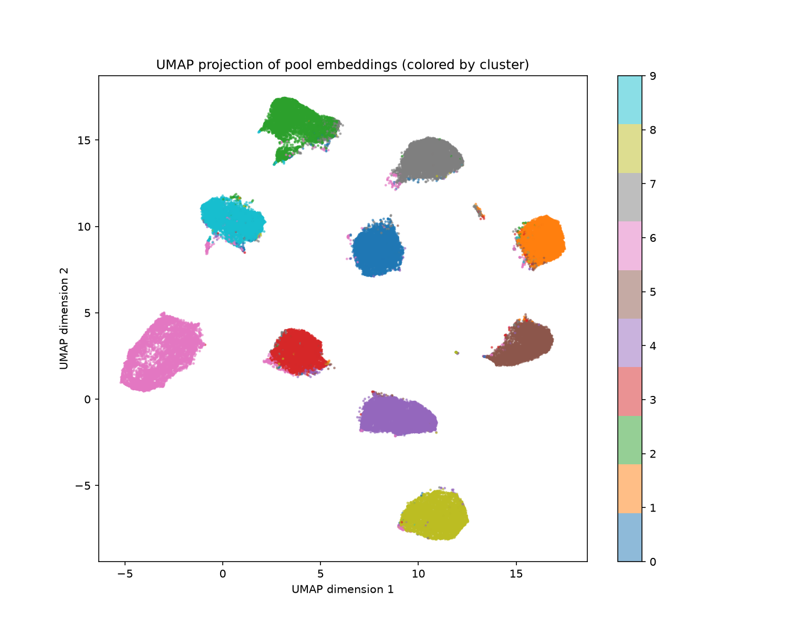

# MNIST Pre-labelling Pipeline

## Problem Statement

Automatic pre-labelling of the MNIST training set (60,000 images) using only
the test split (10,000 images) as a labeled seed set, via embedding-based
clustering and iterative unsupervised label correction.

The pipeline treats the 10k test split as the only labeled data available,
clusters embeddings learned from it to assign initial labels to the 60k pool,
then iteratively refines those labels — never accessing the pool's ground-truth
labels during the labeling process itself.

## Results

Results vary slightly across runs due to GPU non-determinism in weight
initialization. Representative numbers from a verified full pipeline run:

| Stage | Accuracy |
|---|---|
| Initial pre-labelling (clustering + Hungarian assignment) | 96.21% |
| After single-pass correction (iteration 0) | 97.66% |
| After iteration 1 | 98.02% |
| After iteration 2 | 98.11% |
| After iteration 3 | 98.14% |
| After iteration 4 (final) | 98.10% |
| **Total improvement** | **+1.89 percentage points** |

Per-digit accuracy after final correction:

| Digit | 0 | 1 | 2 | 3 | 4 | 5 | 6 | 7 | 8 | 9 |
|---|---|---|---|---|---|---|---|---|---|---|
| Accuracy | 99.16% | 98.87% | 97.82% | 97.39% | 97.93% | 98.10% | 99.32% | 98.24% | 96.17% | 97.87% |

Digit 8 remains hardest (~96%) due to visual similarity with 3, 5, and 9.
Accuracy peaks around iteration 3, then plateaus — consistent with the
confirmation bias effect documented in the noisy-label literature.

Sample outputs from a verified run are available in `results/` — including
the UMAP embedding visualization and the final accuracy JSON log.



## Environment

- OS: Ubuntu 22.04 (WSL2)
- Python: 3.11.15
- GPU: NVIDIA GeForce RTX 3050 Laptop GPU (4GB VRAM)
- CUDA Driver: 13.1 (PyTorch built against CUDA 12.6)
- PyTorch: 2.12.1+cu126

## Running the pipeline

### Option 1 — Docker (recommended, no GPU required, ~25 min)

```bash
# Build the image
docker build -t mnist-prelabelling .

# Run the pipeline
docker run --rm \
  -v $(pwd)/outputs:/app/outputs \
  -v $(pwd)/data:/app/data \
  mnist-prelabelling
```

> **Note on sudo:** Linux users may need `sudo` before docker commands.
> Mac and Windows Docker Desktop users typically don't.

> **CPU vs GPU in Docker:**
> The default Dockerfile uses CPU-only PyTorch for portability (~25 min runtime).
> For GPU acceleration (~8 min), two changes are needed:
>
> 1. Install [NVIDIA Container Toolkit](https://docs.nvidia.com/datacenter/cloud-native/container-toolkit/install-guide.html)
> 2. In `Dockerfile`, replace the base image and PyTorch install:
>
> ```dockerfile
> # Replace:
> FROM python:3.11-slim
> RUN pip install --no-cache-dir torch torchvision \
>     --index-url https://download.pytorch.org/whl/cpu
>
> # With:
> FROM nvidia/cuda:12.6.0-cudnn-runtime-ubuntu22.04
> RUN pip install --no-cache-dir torch torchvision \
>     --index-url https://download.pytorch.org/whl/cu126
> ```
>
> Then run with:
> ```bash
> docker run --gpus all --rm \
>   -v $(pwd)/outputs:/app/outputs \
>   -v $(pwd)/data:/app/data \
>   mnist-prelabelling
> ```

> **docker-compose:** A `docker-compose.yml` is included for users with
> Docker Desktop or Docker Compose v2 (`docker compose up --build`).

Each run creates a timestamped folder under `outputs/run_YYYYMMDD_HHMMSS/`
containing all generated artifacts (embeddings, labels, plots, JSON logs).

### Option 2 — local conda environment (GPU-accelerated, ~8 min)

```bash
# Create environment
conda create -n mnist_prelabelling python=3.11 -y
conda activate mnist_prelabelling

# Install PyTorch with CUDA 12.6
pip3 install torch torchvision --index-url https://download.pytorch.org/whl/cu126

# Install package and remaining dependencies
pip install -e .
pip install scikit-learn umap-learn matplotlib scipy

# Run
mnist-prelabelling
# or:
python src/mnist_prelabelling/pipeline.py
```

### MNIST data
Downloaded automatically on first run via torchvision. Alternatively, download
the four IDX files from the [CVDF MNIST mirror](https://github.com/cvdfoundation/mnist)
and place them in `data/MNIST/raw/`.

### Individual pipeline steps (for debugging or partial runs)
```bash
python src/mnist_prelabelling/training/generate_pool_embeddings.py
python src/mnist_prelabelling/clustering/cluster_embeddings.py
python src/mnist_prelabelling/clustering/visualize_embeddings.py
python src/mnist_prelabelling/clustering/assign_labels.py
python src/mnist_prelabelling/training/retrain_on_pool_labels.py
python src/mnist_prelabelling/clustering/detect_label_errors.py
python src/mnist_prelabelling/clustering/correct_labels.py
python src/mnist_prelabelling/evaluation/evaluate_prelabelling.py
```

### Optional verification scripts
```bash
# Verify CustomCNN against published benchmarks (conventional MNIST split, ~99%)
python src/mnist_prelabelling/training/train.py

# Verify seed classifier generalizes to the pool
python src/mnist_prelabelling/training/train_seed_classifier.py
```

### Offline analysis scripts (use ground truth for strategy selection only)
```bash
python src/mnist_prelabelling/analysis/evaluate_detection_strategies.py
python src/mnist_prelabelling/analysis/evaluate_correction_strategies.py
python src/mnist_prelabelling/analysis/iterative_correction_experiment.py
```

## Project Structure

mnist_prelabelling/

├── src/mnist_prelabelling/

│   ├── pipeline.py      # Main orchestrator — runs the full pipeline end-to-end

│   ├── config.py        # Hyperparameters, paths, random seed

│   ├── models/          # CNN architecture (CustomCNN: forward() + embed())

│   ├── training/        # Seed classifier, embedding generation, pool retraining

│   ├── embeddings/      # Embedding extraction utility

│   ├── clustering/      # UMAP visualization, KMeans, label assignment, error detection, iterative label correction         

│   ├── evaluation/      # Final accuracy reporting

│   ├── analysis/        # Offline strategy-selection experiments (use GT)

│   └── utils/           # Run logging utility

├── docs/                # Architecture, pipeline design, and results documentation

├── results/             # Sample outputs from a verified run (plot + accuracy JSON)

├── Dockerfile           # CPU-only by default; GPU instructions in README

├── docker-compose.yml

└── pyproject.toml       # Package metadata and entry point

## Documentation

See `docs/` for:
- `ARCHITECTURE.md` — design decisions, model choice, method rationale
- `PIPELINE.md` — step-by-step data flow and intermediate outputs
- `RESULTS.md` — detailed accuracy analysis and per-digit breakdown